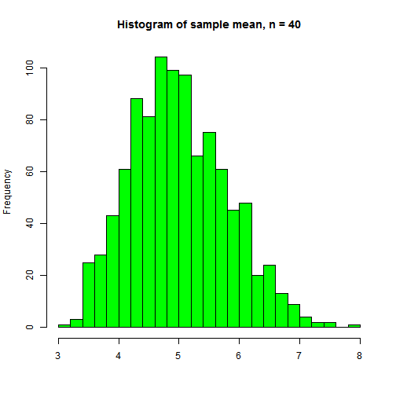
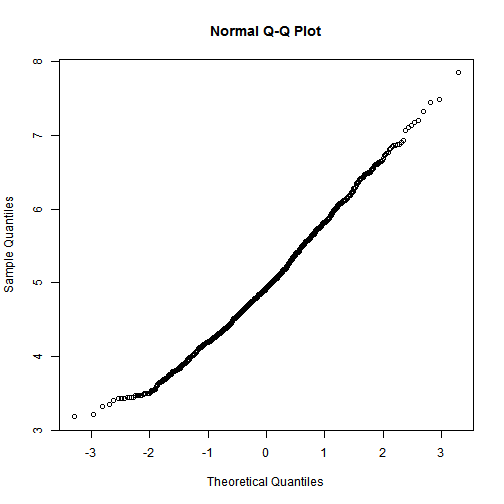

# Sample distribution of n-exponential distributions
# Author: Jorge Chong

## Overview

In this report we are going to show how the central limit theorem applies to
the distribution of the sample mean by running simulations of n (in this case 40) 
exponential distributions. We will show that the distribution of the sample mean
is approximatedly normal with mean equals to the exponential distribution mean and
variance equals to the exponential distribution variance divided by n (40)

## The exponential distribution

The probability density function of the exponential is given by:  


This distribution has a theoretical mean given by the lambda parameter as 1 / lambda and
variance equals 1 / (lambda ^ 2).   
We can plot an exponential with lambda = 0.2, mean = 5, var = 25:

 

## Simulation of a exponential distribution

We can run a simulation of the exponential distribution and plot the histogram


```r
exp_dist <- rexp(1000, rate = 0.2)
hist(exp_dist, 
     breaks = 30, 
     main = "Histogram of an exponential simulation", 
     xlab = "",
     col = "green"
     )
```

 

```r
exp_mean <- mean(exp_dist)
exp_var <- var(exp_dist)
exp_std <- sd(exp_dist)
```

From this simulation the mean is 4.91 and the variance is 22.87

## Simulation of n exponentials

We are going to simulate n exponentials, in this case we choose n = 40, and we are going to
obtain statistics of the sample mean


```r
smean_dist <- c()
lambda <- 0.2
num_sim <- 1000
n <- 40
for (i in 1:num_sim) {
    smean_dist[i] <- mean(rexp(n, lambda))
}

s_mean <- mean(smean_dist)
s_var <- var(smean_dist)
s_std <- sd(smean_dist)

hist(smean_dist, 
     breaks = 30, 
     main = "Histogram of sample mean, n = 40", 
     xlab = "",
     col = "green"
     )
```

 

The distribution of the sample mean resembles a normal distribution. Lets compare the values with the theoretical exponential

Statistic  |  Theoretical exponential | Simulation of exponential | Theoretical CLT              | Sample mean, n = 40
-----------|-------------------------:|--------------------------:|-----------------------------:|------------------:
Mean       | 5        | 4.910374      | 5            | 4.996842
Variance   | 25    | 22.86759       | 0.625   | 0.6422275
Std        | 5        | 4.782007       | 0.7905694 | 0.801391

According to the central limit theorem the theoretical mean of the sample
distribution of the sample mean is the mean of the theoretical exponential, in this
case 5, in our simulation we have a mean of 4.996842. The theoretical
standard deviation of the sample distribution of the sample mean is ` 5 / sqrt(40) ` which is 0.7905694, accordingly, in our simulation we have a standard deviation of 0.801391

Lets overlay a normal distribution `N(mean = 5, std = 5 / sqrt(40))` over the histogram


```r
smean_frame = data.frame(smean_dist)
graph <- ggplot(smean_frame, aes(x = smean_dist))
graph + 
        geom_histogram(binwidth = .2, fill = "gray", colour="black", aes(y = ..density..)) + 
        stat_function(fun = dnorm, args=list(mean=5,sd=5/sqrt(40)), size = 1.5, colour="black") +
        geom_vline(xintercept=5, linetype = "longdash", colour = "red", size=1.1) + 
        geom_vline(xintercept=c(5 + 5/sqrt(40), 5 - 5/sqrt(40)), 
                   linetype = "longdash", colour = "blue", size=1.1) + 
        labs(x = "Sample mean")
```

 

As we can see the distribution of the sample mean for 40 exponentials looks approximately normal.
The dashed line in red is the theoretical mean. The dashed lines in blue are mean - one standard deviation and the mean + one standard deviation.

Finally, lets use a Q-Q plot to demonstrate that the distribution of the sample mean of 40 exponentials
is approximately normal


```r
qqnorm(smean_dist)
```

 
